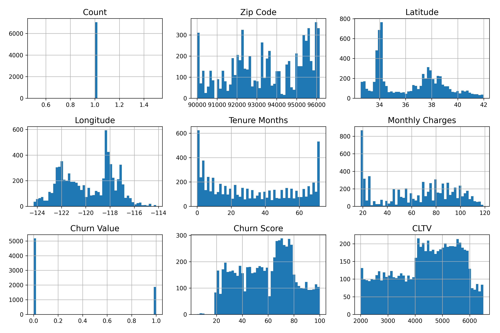
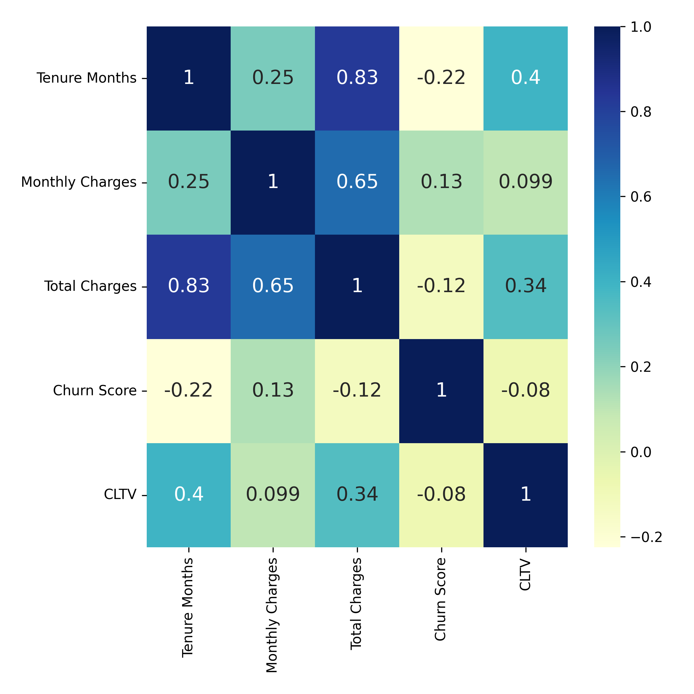
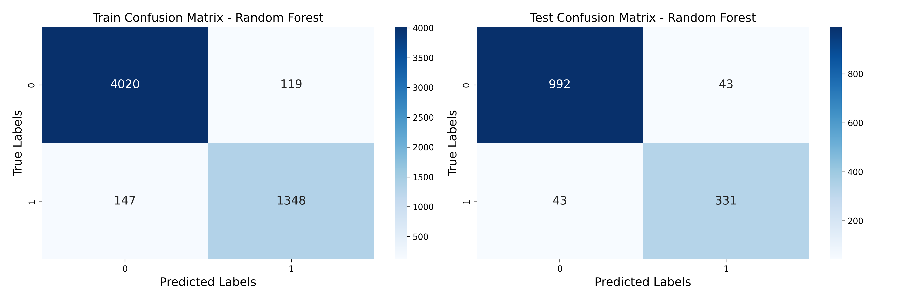
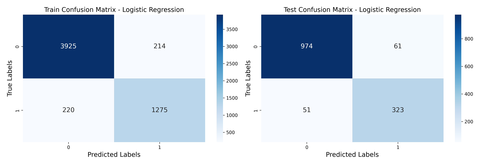

# Customer-Churn-Prediction-using-Machine-Learning
A fictional telco company that provided home phone and Internet services data  from customers in California  to predict their future churning rate with machine learning

Run this project in Google Colab.

# Requirements 
- Pandas
- NumPy
- Scikit-Learn
- Matplotlib
- Seaborn

# Dataset 
- Telco customer churn: IBM dataset [Download link](https://www.kaggle.com/datasets/yeanzc/telco-customer-churn-ibm-dataset/code)
- Put the Extracted data into the ./data folder.

# Data Visualization 

# Corelation Matrix 

# Reuslt (Confusion Matrix)

## Random Forrenst Model 

## Logistic Regression Model

## Comprehensive summary 

From the model evaluation, we can see that out of 3 machine learning algorithms, Random Forest provides the highest accuracy for predicting the number of churn customers, **94%** after hyper-tuning the parameters. Before hyper-tuning, it was 92%. of the ROC and AUC scores; we can also interpret that both the **Decision Tree** and **Random forest** algorithms are efficient in predicting future churn values. We can state from the overall evaluation outcomes that **Random Forest** performs slightly better than the other two algorithms.

## Contributing

1. Fork the repository.
2. Create a new branch for your feature using `git checkout -b feature/your-feature-name`.
3. Make your changes and commit them using `git commit -m "Add your commit message here"`.
4. Push your changes to your fork using `git push origin feature/your-feature-name`.
5. Open a pull request to the main repository.
